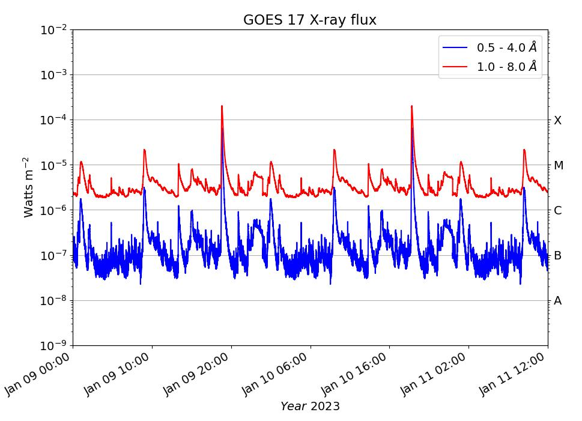

# GOES-data
This code is for downloading and plotting GOES X-ray Flux from Space Weather Prediction Center - NOAA. This is an alternative code rather than using sunpy package.

**To sun the code**

import goes

start_time = '2023-1-10 00:00'
end_time = '2023-01-12 00:30'

X=goes.goes_xray(start_time, end_time,SatelliteNumber = 17)     # select the time limits and goes satellite number

picked_time, fluxA, fluxb = X.get_data()                        #  get the data

X.plot_xray(picked_time, fluxA, fluxb)                          # plot_xray( time , fluxA , fluxb )  
 
pt, pv = X.xray_peaks(fluxA,'C')                                # xray_peaks(  wavelength  , x-ray class  ) 

